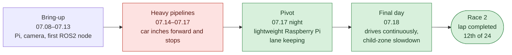
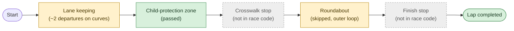
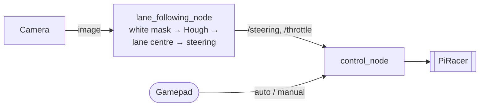

# SEA:ME Hackathon 2025 — Camera Lane Following on a Raspberry Pi Scale Car

**English** | [한국어](README_ko.md)

A four-person team's ROS2 stack that drove a PiRacer Pro (Raspberry Pi 4 + USB camera) around a lane track using only a camera and classic OpenCV (deep learning, special cameras and motor changes were listed as not allowed)

| | |
|---|---|
| Contest | 2025 SEA:ME Hackathon — Scale-Car Autonomous Driving Bootcamp (2025.07.16–18, Seoul) · 24 teams |
| Team | **Autonome** — Yoonju Jeong (team lead), Chaeyeon Kim, Sihyeon Park, Hyojeong Oh |
| Stack | ROS2 Humble · Python · OpenCV · PiRacer Pro (Raspberry Pi 4, USB camera, gamepad) |
| Result | **Completed the course · child-protection zone passed · 12th of 24 · 4:52.5 with penalties** |

## The Story in One Picture



- **Goal**: one lap of a white-lane track as fast as possible, with crosswalk, child-zone, roundabout and finish missions
- **Penalties as applied**: +30 s per lane departure, +1 min per failed mission; leaving the yellow-lane roundabout cost no time but sent the car back to the roundabout entry
- **What held us back**: frame-by-frame lane fitting, vanishing points and debug windows at 1280×720 were too heavy for the Raspberry Pi
- **What turned it around**: a much lighter pipeline on a 640×480 camera on the last night, then on-track tuning and the child-zone slowdown on the final day

## Mission and Result



| Mission | Result |
|---|---|
| Lane keeping | Lap completed, about 2 lane departures on curves |
| Child-protection zone | **Passed** |
| Roundabout | Skipped — took the outer loop instead of the yellow-lane shortcut |
| Crosswalk stop | Not in the race code (drafts did not work in time) |
| Finish stop | Not in the race code (chessboard draft did not work in time) |
| **Total** | **4:52.5 with penalties · 12th of 24** |

## System



| Part | What it does |
|---|---|
| Lane detection | White HSV mask → trapezoid ROI → Canny → Hough → one averaged line per side |
| Steering | Lane-centre offset → heading angle → proportional steering with dead band and trim |
| Child zone | Many red pixels in view → slow down |
| Control | Gamepad button switches between the lane node and manual driving |

## Team

|  |  |  |  |
|:---:|:---:|:---:|:---:|
| **Chaeyeon Kim**<br/>[@ChaeYeonKim0204](https://github.com/ChaeYeonKim0204) | **Sihyeon Park**<br/>[@kha-2](https://github.com/kha-2) | **Hyojeong Oh**<br/>[@ohhyojeong](https://github.com/ohhyojeong) | **Yoonju Jeong**<br/>[@yoonju04](https://github.com/yoonju04) |
| Environment & repo<br/>Integration & debugging<br/>Final lane node base | Lane detection<br/>Colour measurement<br/>Child-zone slowdown | Control & joystick<br/>Child-zone idea<br/>Chessboard finish stop | **Team lead**<br/>PID lane node<br/>Child-zone slowdown |

## Contributions

### Participation by Area

◎ led · ○ actively contributed · △ took part

| Area | **Chaeyeon Kim** | **Sihyeon Park** | **Hyojeong Oh** | **Yoonju Jeong** |
|---|:---:|:---:|:---:|:---:|
| Team operations | ○ | △ | ○ | ◎ |
| Dev environment and integration | ◎ | △ | ○ | ○ |
| Lane detection | ○ | ◎ | | ◎ |
| Steering control | ◎ | ○ | | ◎ |
| Vehicle control (`control_node`) | ◎ | | ◎ | △ |
| Joystick auto/manual switching | △ | | ◎ | △ |
| Missions | ○ | ◎ | ○ | ◎ |
| Track testing and tuning | ◎ | ○ | △ | ◎ |

### Highlights by Member

| Member | Highlights |
|---|---|
| **Chaeyeon Kim**<br/>@ChaeYeonKim0204 | • Pi, camera and X11 bring-up, first ROS2 image node<br/>• Ran and debugged every member's code on the car<br/>• **Found the lightweight Raspberry Pi lane-keeping pipeline and rebuilt lane6 on it** (07.17 night) → the car drove; the final race code is built on it<br/>• Tried a series of steering controllers and tuned the final P steering |
| **Sihyeon Park**<br/>@kha-2 | • First ROS2 Humble setup and the implementation plan<br/>• Early lane detection, box-ROI node and the lane5 pipeline<br/>• **Measured the track colours on site** → red thresholds of the passed mission<br/>• Co-led the child-zone slowdown with Yoonju Jeong |
| **Hyojeong Oh**<br/>@ohhyojeong | • **Wrote `control_node` and the joystick auto/manual scheme** that ran in the final race<br/>• Proposed red-colour detection for the child zone<br/>• Tried a chessboard finish stop<br/>• SSH, Pi Wi-Fi, joystick debugging, equipment logistics |
| **Yoonju Jeong**<br/>@yoonju04<br/>Team lead | • Formed the team, ran meetings, schedules and logistics<br/>• Split the system into image check / publisher / mode switch<br/>• Ported the DonkeyCar PID into lane5 ("it drove"), lane7, C++ port<br/>• Co-led the child-zone slowdown with Sihyeon Park |

Who did what and when: [docs/contributions.md](docs/contributions.md)

## Key Problems

| Problem | Cause | What we did |
|---|---|---|
| Lane departures on curves | One fixed throttle (0.26) for straights and curves | Slowing down on curves was tried but did not work in time; kept the fast throttle, accepted ~2 departures and skipped the roundabout |
| Car inched forward and stopped | Too much work per frame at 1280×720 on a Raspberry Pi | Switched to a lightweight pipeline and a 640×480 camera |
| Steering in the wrong direction | Image coordinates (y pointing down) read like a normal x-y plot | Steer from the lane-centre offset instead of the line slope |
| Auto mode ignored the lane node | A commit dropped the control node's subscriptions | Restored them; check the node graph first next time |
| Crosswalk and finish stops missing | Left to the last morning | Missions early, even in a crude form |

## Post-mortem

If the crosswalk and finish stops had worked *(estimate)*: about 2:52.5 instead of 4:52.5, two minutes of mission penalties gone. The drafts existed (white-pixel stop line, 7 s crosswalk timer, chessboard finish) but none ran in time.

Full analysis, lane-node evolution and troubleshooting log: [docs/postmortem.md](docs/postmortem.md)

## Quick Start

```bash
# ROS2 Humble workspace on the PiRacer, this repository as src/
rosdep install --from-paths src -i -y
colcon build && source install/setup.bash

ros2 launch lane_following lane_following_launch.py   # camera + lane node + control_node
ros2 launch control control_launch.py                 # gamepad mode switch + manual control
```

Exact race code: `git checkout contest-2025-07-18`

## Repository

- `lane_following/`: final race lane node
- `control/`: PiRacer control node, gamepad mode switch and manual control
- `camera/`: USB camera driver (third-party fork)
- `experiments/`: lane nodes tried during the contest
- `tools/`: frame capture and HSV picker used on the track

## Docs

- [docs/contributions.md](docs/contributions.md): each member's work with dates
- [docs/postmortem.md](docs/postmortem.md): root causes, lane-node evolution, troubleshooting log, lessons
- [docs/timeline.md](docs/timeline.md): preparation, development and contest days
- [docs/repository.md](docs/repository.md): folder tree, how the team workflow changed, branches and tags, third-party sources
