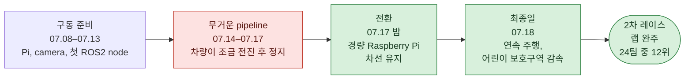
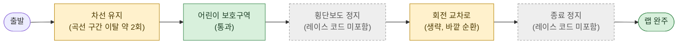
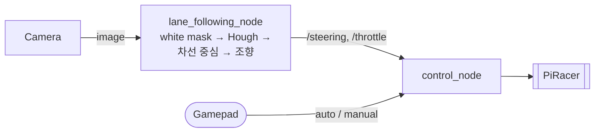

# SEA:ME 해커톤 2025 - Raspberry Pi 스케일카 카메라 차선 주행

[English](README.md) | **한국어**

4인 팀 ROS2 스택 정리

PiRacer Pro (Raspberry Pi 4 + USB camera)를 camera와 classic OpenCV만으로 차선 트랙 주행  
딥러닝, 특수 카메라, 모터 변경은 허용되지 않음

| | |
|---|---|
| 대회 | 2025 SEA:ME Hackathon - Scale-Car Autonomous Driving Bootcamp (2025.07.16–18, Seoul) · 24 teams |
| 팀 | **Autonome** - 정윤주 (팀장), 김채연, 박시현, 오효정 |
| 스택 | ROS2 Humble · Python · OpenCV · PiRacer Pro (Raspberry Pi 4, USB camera, gamepad) |
| 결과 | **코스 완주 · 어린이 보호구역 통과 · 24팀 중 12위 · 패널티 포함 4:52.5** |

## 한 장 요약



- **목표**: 흰색 차선 트랙 1랩 최대한 빠르게 완주, 횡단보도, 어린이 보호구역, 회전 교차로, 종료 지점 정지선 미션 포함
- **적용 패널티**: 차로 이탈마다 +30초, 미션 실패마다 +1분, 노란 차선 회전 교차로 이탈은 시간 패널티 없음, 차량은 회전 교차로 진입 지점으로 복귀
- **문제**: Raspberry Pi에서 1280×720 프레임별 차선 피팅, 소실점, debug window 처리 과부하
- **전환점**: 마지막 밤 640×480 camera 기반 경량 pipeline 전환, 최종일 트랙 튜닝과 어린이 보호구역 감속 적용

## 미션·결과



| 미션 | 결과 |
|---|---|
| 차선 유지 | 랩 완료, 곡선 구간에서 차로 이탈 약 2회 |
| 어린이 보호구역 | **통과** |
| 회전 교차로 | 생략 - 노란 차선 지름길 대신 바깥 순환 경로 주행 |
| 횡단보도 정지 | 레이스 코드 미포함 (초안 시간 내 미작동) |
| 종료 정지 | 레이스 코드 미포함 (체스보드 초안 시간 내 미작동) |
| **합계** | **패널티 포함 4:52.5 · 24팀 중 12위** |

## 시스템



| 부분 | 내용 |
|---|---|
| 차선 검출 | 흰색 HSV mask → 사다리꼴 ROI → Canny → Hough → 좌우 차선별 평균 선 1개 |
| 조향 | 차선 중심 offset → heading angle → dead band와 trim을 적용한 비례 조향 |
| 어린이 보호구역 | 화면 내 빨간 pixel 다수 감지 → 감속 |
| 제어 | gamepad button으로 lane node와 수동 주행 전환 |

## 팀

|  |  |  |  |
|:---:|:---:|:---:|:---:|
| **김채연**<br/>[@ChaeYeonKim0204](https://github.com/ChaeYeonKim0204) | **박시현**<br/>[@kha-2](https://github.com/kha-2) | **오효정**<br/>[@ohhyojeong](https://github.com/ohhyojeong) | **정윤주**<br/>[@yoonju04](https://github.com/yoonju04) |
| 환경·저장소<br/>통합·디버깅<br/>최종 차선 node 기반 | 차선 검출<br/>색상 측정<br/>어린이 보호구역 감속 | 제어·joystick<br/>어린이 보호구역 아이디어<br/>체스보드 종료 정지 | **팀장**<br/>PID 차선 node<br/>어린이 보호구역 감속 |

## 기여

### 영역별 참여

◎ 주도 · ○ 적극 참여 · △ 참여

| 영역 | **김채연** | **박시현** | **오효정** | **정윤주** |
|---|:---:|:---:|:---:|:---:|
| 팀 운영 | ○ | △ | ○ | ◎ |
| 개발 환경·통합 | ◎ | △ | ○ | ○ |
| 차선 검출 | ○ | ◎ | | ◎ |
| 조향 제어 | ◎ | ○ | | ◎ |
| 차량 제어 (`control_node`) | ◎ | | ◎ | △ |
| 조이스틱 자동/수동 전환 | △ | | ◎ | △ |
| 미션 | ○ | ◎ | ○ | ◎ |
| 트랙 테스트·튜닝 | ◎ | ○ | △ | ◎ |

### 팀원별 주요 작업

| 팀원 | 주요 작업 |
|---|---|
| **김채연**<br/>@ChaeYeonKim0204 | Pi, camera, X11 구동 준비, 첫 ROS2 image node<br/>모든 팀원 코드 차량 실행과 디버깅<br/>**경량 Raspberry Pi 차선 유지 pipeline 발견 및 lane6 재구성** (07.17 밤) → 차량 주행, 최종 레이스 코드 기반<br/>조향 controller 여러 방식 시도, 최종 P steering 튜닝 |
| **박시현**<br/>@kha-2 | 첫 ROS2 Humble 설정과 구현 계획<br/>초기 차선 검출, box-ROI node, lane5 pipeline<br/>**현장 트랙 색상 측정** → 통과한 미션의 red threshold<br/>정윤주와 어린이 보호구역 감속 공동 주도 |
| **오효정**<br/>@ohhyojeong | **최종 레이스에서 실행된 `control_node`와 joystick auto/manual 구조 작성**<br/>어린이 보호구역 red-colour detection 제안<br/>체스보드 종료 정지 시도<br/>SSH, Pi Wi-Fi, joystick 디버깅, 장비 관리 |
| **정윤주**<br/>@yoonju04<br/>팀장 | 팀 구성, 회의, 일정, 운영<br/>시스템을 image check / publisher / mode switch로 분리<br/>DonkeyCar PID를 lane5 ("it drove"), lane7, C++ port로 이식<br/>박시현과 어린이 보호구역 감속 공동 주도 |

누가 무엇을 언제 했는지: [docs/contributions_ko.md](docs/contributions_ko.md)

## 주요 문제

| 문제 | 원인 | 조치 |
|---|---|---|
| 곡선 구간 차로 이탈 | 직선과 곡선 모두 고정 throttle (0.26) 적용 | 곡선 구간 감속을 시도했으나 제때 동작하지 않음, 빠른 throttle 유지, 약 2회 이탈 수용 및 회전 교차로 생략 |
| 차량이 조금 전진 후 정지 | Raspberry Pi에서 1280×720 프레임당 작업량 과다 | 경량 pipeline과 640×480 camera로 전환 |
| 조향 방향 반대 | 이미지 좌표계 (y 아래 방향)를 일반 x-y 그래프처럼 해석 | 선 기울기 대신 차선 중심 offset으로 조향 |
| auto mode에서 lane node 무시 | commit 중 control node 구독 누락 | 구독 복구, 다음에는 node graph 우선 확인 |
| 횡단보도·종료 정지 누락 | 마지막 아침까지 미룸 | 미션은 조잡한 형태라도 초반 구현 |

## 사후 분석

횡단보도와 종료 정지가 동작했다면 *(추정)* 4:52.5 대신 약 2:52.5, 미션 패널티 2분 제거 가능  
초안은 존재함: 흰색 pixel 정지선, 7초 횡단보도 timer, 체스보드 종료 지점  
시간 내 실행 실패

전체 분석, lane-node 변화, troubleshooting log: [docs/postmortem_ko.md](docs/postmortem_ko.md)

## 빠른 시작

```bash
# ROS2 Humble workspace on the PiRacer, this repository as src/
rosdep install --from-paths src -i -y
colcon build && source install/setup.bash

ros2 launch lane_following lane_following_launch.py   # camera + lane node + control_node
ros2 launch control control_launch.py                 # gamepad mode switch + manual control
```

실제 레이스 코드: `git checkout contest-2025-07-18`

## 저장소

- `lane_following/`: 최종 레이스 lane node
- `control/`: PiRacer control node, gamepad mode switch, manual control
- `camera/`: USB camera driver (third-party fork)
- `experiments/`: 대회 중 시도한 lane node
- `tools/`: 트랙에서 사용한 frame capture와 HSV picker

## 문서

- [docs/contributions_ko.md](docs/contributions_ko.md): 날짜별 팀원 작업
- [docs/postmortem_ko.md](docs/postmortem_ko.md): root cause, lane-node 변화, troubleshooting log, 교훈
- [docs/timeline_ko.md](docs/timeline_ko.md): 준비, 개발, 대회 일정
- [docs/repository_ko.md](docs/repository_ko.md): 폴더 tree, 팀 workflow 변화, branch와 tag, third-party 출처