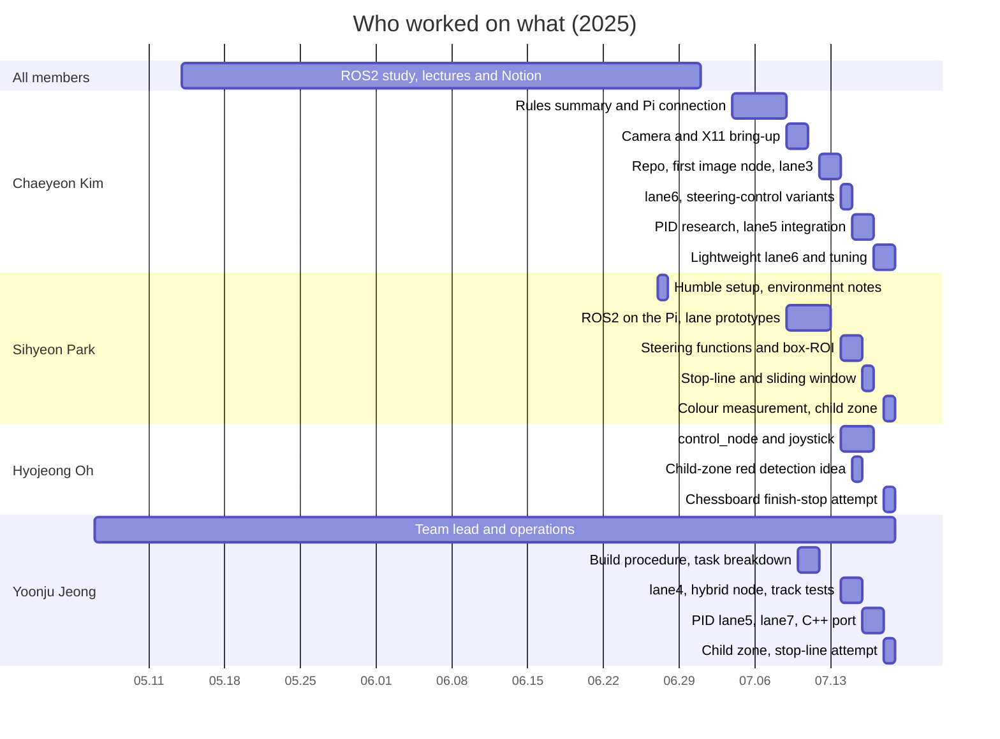

# Team Contributions

[← README](../README.md) · **English** | [한국어](contributions_ko.md)

## At a Glance

| Member | Role | Main deliverables |
|---|---|---|
| **Chaeyeon Kim** @ChaeYeonKim0204 | Environment, integration, final lane node | camera bring-up, GitHub repo, lane3, lane6, `lane_following_node` |
| **Sihyeon Park** @kha-2 | Perception research and design | lane prototypes, box-ROI node, lane5 pipeline, colour measurements, child-zone slowdown, `tools/hsv_picker.py` |
| **Hyojeong Oh** @ohhyojeong | Vehicle control and operations | `control_node`, joystick auto/manual scheme, child-zone idea |
| **Yoonju Jeong** @yoonju04 | Team lead, main algorithm developer during the contest | lane4, PID lane5, lane7, lane5c, child-zone slowdown, `tools/capture_frame.py` |

All commits in this repository were made from Chaeyeon Kim's account, which owned the repository and the build laptop. Much of the code inside them was written by teammates and shared through the team chat; `Co-authored-by` trailers mark those commits.

Usual workflow: each member wrote code and shared it in the chat; Chaeyeon Kim ran it on the car, fixed syntax errors, typos and missing imports from the error messages, and reported algorithm problems back to the author for a fix. Most ideas for new approaches also came from Chaeyeon Kim (team recollection).

## Who Did What, When

| Date | Member | Work | Result |
|---|---|---|---|
| 05.06–07 | Yoonju Jeong | Formed the team, wrote the motivation letter, submitted the application, name shortlist | Team registered |
| 05.07 | Chaeyeon Kim | Wrote the poll-chosen name "Autonome" on the form; noticed every member had to file the form | Name settled |
| 05.14–06.30 | All members | ROS2 study together: lectures, Notion notes, pre-training (06.19), study meeting (06.30) | Shared basics before the hardware arrived |
| 05.21 | Sihyeon Park | Installed ROS2 Humble first | Team agreed on Humble |
| 06.27 | Sihyeon Park | ROS2 environment notes (`.bashrc` aliases, `ROS_DOMAIN_ID`) | Shared setup |
| 07.04 | Chaeyeon Kim | Shared a transcript and summary of the equipment-handout session | Team's rule reference |
| 07.08 | Sihyeon Park | Five-item implementation plan | Same split as the final system |
| 07.08 | Chaeyeon Kim | First Raspberry Pi connection; official setup documents; flagged the IP change with the contest SD card | Pi reachable |
| 07.09 | Sihyeon Park | Installed ROS2 on the Pi | — |
| 07.10 | Chaeyeon Kim | Camera debugging: driver, pydantic, X11 forwarding (VcXsrv + `DISPLAY`) | First live camera image + team guide |
| 07.10–11 | Yoonju Jeong | Workspace and colcon build procedure, publisher/subscriber practice, task breakdown | Image check / publisher / mode switch |
| 07.11 | Hyojeong Oh | SSH to the Pi | Working remote access |
| 07.12 | Chaeyeon Kim, Sihyeon Park | First ROS2 image subscriber (Chaeyeon's five-point checklist, Sihyeon's code) | Hough pipeline on the car |
| 07.12 | Chaeyeon Kim | GitHub repo, team invites, Git workflow guide, lane3 | Shared code base |
| 07.13 | Chaeyeon Kim, Hyojeong Oh | Test-track materials | School test track |
| 07.14 | Chaeyeon Kim | lane6 with a fixed steering table, then Pure Pursuit, PD and heading-control variants | lane6 starts moving the car (short runs) |
| 07.14 | Yoonju Jeong | lane6 entry-point fix, lane4 track tests | Lane followed with oscillation |
| 07.14 | Sihyeon Park | Steering-angle functions (`180 - angle` mirror, one-lane fallback), test videos, quadratic centre-line idea | — |
| 07.14–15 | Hyojeong Oh | Joystick auto/manual control | Mode switch working |
| 07.15 | Sihyeon Park | Box-ROI lane node (with a stop-line check) | Stopped on the car ("right lane not detected") |
| 07.15 | Yoonju Jeong | Hybrid curve / centroid node, "#찐최" lane node | Not used on the car |
| 07.15 | Hyojeong Oh | Red HSV detection for the child zone | Idea used in the final node |
| 07.15 | Chaeyeon Kim | PID research, shared the DonkeyCar line-follower code | Basis of the PID lane5 |
| 07.16 | Yoonju Jeong | Ported the DonkeyCar PID into lane5 on Sihyeon Park's pipeline, TypeError fix | "It drove" commit |
| 07.16 | Chaeyeon Kim | Integrated lane5, ran it on the car, reported the TypeError | — |
| 07.16 | Sihyeon Park | Stop-line state machine, sliding window with histogram peaks | Not integrated |
| 07.17 | Chaeyeon Kim, Yoonju Jeong | BEV reference photos (Chaeyeon shooting, Yoonju directing), capture scripts | BEV not implemented |
| 07.17 | Chaeyeon Kim | New camera test (640×480 max); questioned the PID setpoint; flagged the missing finish stop | Camera switched |
| 07.17 | Yoonju Jeong | lane7, PID lane5 revisions, single representative-line module, quadratic-fit version | Last commit made during the contest |
| 07.17 | Chaeyeon Kim | Lightweight lane6 (21:57), one-lane fallback and timing versions (22:22) | **Car drove from 01:25 on 07.18** |
| 07.18 | Sihyeon Park | On-track colour measurements, HSV picker | Red thresholds for the final node |
| 07.18 | Sihyeon Park, Yoonju Jeong | **Child-zone slowdown** on Chaeyeon Kim's lane node: wider white mask, yellow branch off, red-zone function (led jointly) | **Child zone passed** |
| 07.18 | Chaeyeon Kim | Integrated the final race version (13:02): the lightweight lane node with the child-zone changes, fixing syntax errors and typos (e.g. the broken red range, the `teering_angle` typo) | **Lap completed** |
| 07.18 | Sihyeon Park, Yoonju Jeong | Stop-line / crosswalk detection: white-pixel count with a 7 s timer in the morning (Chaeyeon Kim's idea), then a vertical-line count for the crosswalk at 13:02 | Unreliable, no time to fix → dropped |
| 07.18 | Hyojeong Oh | Chessboard detection to stop at the finish (Sihyeon Park posted a version at 13:18) | Undefined variables → not used |

## Chaeyeon Kim

**Preparation**
- Wrote the poll-chosen name on the form and caught the per-member filing rule (05.07)
- ROS learning path from a professor (05.14), scheduling and meeting notes
- Shared the transcript and summary of the equipment-handout session (07.04): rules, mandatory mode switch, on-site colour tuning, "keep the algorithm simple for the Pi"
- First Raspberry Pi connection, official setup documents, the SD-card IP issue (07.08)

**Environment and repository**
- Camera on the Pi: driver install, pydantic downgrade, then the real fix — VcXsrv with access control off and `DISPLAY=<laptop IP>:0` (07.10)
- Five-point checklist for the first image subscriber: dependencies, package layout, topic name, typo, launch (07.12)
- Private GitHub repository so teammates could read the Pi code, Git workflow guide (07.12); every commit, dated backup branches
- Phone-hotspot network for the Pi (07.11, 07.15)

**Steering control (tried in turn)**
- Fixed steering table, hard-coded left / straight / right values (07.14)
- Pure Pursuit toward the vanishing point (07.14 15:52)
- PD on the lane offset: kp 1.0 / kd 0.4 locally, kp 0.4 / kd 0.1 shared (07.14 17:20–17:58)
- Heading control in vehicle coordinates with the image y-axis flipped (07.14 21:33)
- PID research and the DonkeyCar line follower (07.15), PID setpoint review (07.17)
- Rule-based slope steering and a one-lane fallback (07.17 22:22)
- Final proportional steering: gain, dead band (±5° → ±8°), trim, asymmetric limits and throttle tuned on the track (07.18)

**Lane following**
- lane3 (07.12); lane6 with a fixed steering table → the car starts moving in short runs (07.14)
- PID research and the DonkeyCar line-follower code that the PID lane5 ported (07.15); integrated and ran lane5 on the car (07.16)
- New camera test, PID-setpoint and finish-stop review (07.17)
- Found the Instructables "Lane Keeping Car" Raspberry Pi algorithm and merged it into our node as `짜집기.py` (07.17 21:57), including `compute_pd_control`; one-lane fallback and per-stage timing versions (22:22)
- Fixed the averaging-loop crash and added the -0.23 trim (07.18 01:25); integrated the final race version (13:02), the lightweight node with Sihyeon Park's and Yoonju Jeong's child-zone changes

**Integration, ideas and team**
- **Vehicle control**: diagnosed the silent `control_node` (07.15), posted the 07.16 version with the auto-mode subscriptions restored, -0.23 initial steering and timer changes (07.16 16:58), integrated it with the lane nodes
- Proposed counting white pixels for stop-line / crosswalk detection after the slope-based draft (07.18)
- **Integration and debugging**: ran teammates' code on the car, fixed syntax errors, typos and missing imports from the error messages, and reported algorithm problems back to the authors (e.g. lane5 indentation and debug windows on 07.16, the red range and `teering_angle` typo on 07.18)
- Proposed logging joystick runs as ground truth (07.12), arranged a shared practice track with team boxbox (07.16)

## Sihyeon Park

**Preparation**
- Brought Hyojeong Oh into the team (05.06)
- Installed ROS2 Humble first and shared a ROS lecture playlist (05.21)
- ROS2 environment notes: `.bashrc` aliases, `ROS_DOMAIN_ID`, sourcing after each build (06.27); Notion ROS2 study page shared at the study meeting (06.30)
- Five-item implementation plan: mode switch, usb_cam, lane node over image publish/subscribe, PiRacer control, Pi issues (07.08)
- Installed ROS2 on the Raspberry Pi and shared an OpenCV lane-detection tutorial (07.09)

**Lane detection**
- Lane-detection code in Notion: brightness / HSV mask, ROI, Hough, left/right regression (07.10), the basis of lane1–3
- First ROS2 image subscriber with Chaeyeon Kim (07.12); the car run on the school test track filmed (07.13)
- Steering-angle functions in three revisions: slope → angle, `180 - angle` mirror, one-lane fallback (07.14 13:57–15:35); five test-run videos (07.14)
- Quadratic centre-line idea for a bird's-eye view (07.14 21:26)
- Box-ROI lane node: 6 + 5 lane boxes, white-pixel centroids, 2 stop-line boxes (07.15 09:57–10:09); planned larger boxes after the "right lane not detected" run
- Quadratic `fit_line` / `regression` functions with six representative points (07.15 14:03)
- Revised the "#찐최" node into a quadratic centre line (07.15 22:44), the pipeline the 07.16 PID lane5 was built on
- Sliding-window detector: histogram peaks, 9 windows, second-order fit (07.16 23:23)
- Code review of the PID lane5 ("slope is not needed") and an averaged-line alternative (07.17)

**Missions and measurement**
- Stop-line state machine: white pixels in a small ROI, codes 0/1/2 so the roundabout stop line is ignored after the crosswalk (07.16, not integrated)
- **On-track colour measurements** with the HSV picker (07.18 09:19–10:59): red H 174–179 → final thresholds; yellow samples far outside the mask
- **Co-led the child-zone slowdown** on Chaeyeon Kim's lane node with Yoonju Jeong (07.18): wider white mask, yellow branch off, red-zone function with the measured thresholds
- Co-led the white-pixel stop-line / crosswalk detection with Yoonju Jeong (07.18, dropped); posted a chessboard finish-stop version (13:18)

**Team**
- Team slogan "소처럼 일해서 완주로" (07.16)

## Hyojeong Oh

**Preparation**
- Team-name poll and schedule matching for the first meeting (05.06–07)
- Shared the official participant chat and got the organizers to admit Chaeyeon Kim when it was full (06.02)

**Environment**
- SSH access to the Raspberry Pi (07.11)
- Carried the Pi between labs for the hotspot fix (07.15); changed the Pi's Wi-Fi at school before leaving for the venue (07.16)
- Joystick detection check with pygame (07.16 22:52)

**Vehicle control**
- **`control_node` and the joystick scheme**: PiRacerPro driver that forwards either lane-node or gamepad commands; auto by default, a button press switches to manual (07.14–15)
- Posted the joystick version of `control_node` while the team debugged the silent control node (07.15 16:30–16:55)
- Suspected the 0.2 s control period as a cause of slow response (07.16 01:24)
- Its structure ran in the final race; the auto-mode subscriptions were restored on 07.16

**Missions**
- Red-colour detection for the child-protection zone: any red → slow and straight (07.15 18:07) → idea used in the final node
- Chessboard detection (`cv2.findChessboardCorners`) to stop at the finish line (07.18, not used in the final run)

**Operations**
- Test-track materials and measuring items (07.13), moving the equipment to the venue (07.16)

## Yoonju Jeong

**Team lead**
- Formed the team, name shortlist, motivation letter, application (05.06–07)
- Professor meeting (05.14), online meetings on Discord (05.27, 07.11), team T-shirts (06.27)
- Set the week goal "write lane-detection code" (06.30); rooms, power strips and the grad-student check of the Pi (07.09–10); assembly plan for the venue (07.16)

**System design and environment**
- Shared a C++ lane-detector example and a PiRacer motor test (07.10)
- Workspace and colcon build procedure, publisher/subscriber practice (07.10–11)
- Raspberry Pi on a phone hotspot with SSH and X11 (07.11)
- Split the system into image check / steering-throttle publisher / mode switch (07.11)
- Suggested the `package.xml` dependency fix for the colcon error (07.12); re-applied the lane6 entry-point fix lost in a pull (07.14)

**Lane following**
- lane4 track tests: follows the lane but oscillates (07.14); tested Chaeyeon Kim's Pure Pursuit and reported it (07.14 16:00)
- Ran Sihyeon Park's box-ROI node as lane5 and posted the logs (07.15 15:29)
- Hybrid node: quadratic fit, centroids and straight-line fallback, ~850 lines (07.15 15:56); "#찐최" lane node (07.15 22:25)
- Reviewed the "#찐최" node, planned the PID overnight (07.16 00:49–01:06)
- Ported the DonkeyCar PID into lane5 on Sihyeon Park's pipeline (07.16 15:43–16:06) → "it drove" (07.16); fixed the `predicDir` TypeError (17:41)
- C++ port lane5c (07.16 23:20)
- lane7 with histogram + PID (07.17 00:28), Yoonju Jeong's own idea (confirmed by Sihyeon Park)
- BEV research, calibration-photo direction and capture scripts (07.17 03:33–04:37)
- PID lane5 versions A–E with hard-coded one-lane steering (07.17 13:47–15:33), single representative-line module (17:19)
- Quadratic-fit PID lane5 (07.17 19:28–20:07) — the last commit made during the contest

**Missions**
- Camera flip command (07.18 07:59)
- White-pixel stop-line / crosswalk detection with a 7 s timer (10:48–10:51), vertical-line crosswalk check (13:02), co-led with Sihyeon Park (dropped)
- **Co-led the child-zone slowdown** on the final node with Sihyeon Park (07.18): wider white mask, yellow branch off, red-zone function

## Not in the Final Code

| Work | Member | Why it was not used |
|---|---|---|
| lane4, lane5 (PID), lane5c, lane7 | Yoonju Jeong, Sihyeon Park | Too heavy for the Pi or not ready in time (kept in `experiments/`) |
| Stop-line state machine, sliding window | Sihyeon Park | Not integrated |
| Stop-line / crosswalk by white-pixel count with a 7 s timer | Sihyeon Park, Yoonju Jeong (idea: Chaeyeon Kim) | Unreliable and erroring, no time to fix before race 2 |
| Chessboard finish stop | Hyojeong Oh (version posted by Sihyeon Park) | Undefined variables in the 13:18 version |
| Yellow-lane branch | Chaeyeon Kim | Crashed when yellow was seen; track yellow did not match the mask |
| BEV (bird's-eye view) | Yoonju Jeong, Chaeyeon Kim | Researched and photographed, never implemented |

## Sources and Caveats

- Evidence: git history, the team KakaoTalk chat (05.06–07.18), Notion exports, local working files, the official guideline and handout PDFs; team and university counts from press coverage
- The person who pasted code in the chat is not always the person who wrote it; attributions follow the chat context and were confirmed by Chaeyeon Kim where possible
- From the team's recollection (not visible in the chat): the white-pixel stop-line idea and its implementers, the child-zone lead, and the chessboard owner
- Confirmed by Sihyeon Park (2026-10-07): the lane7 histogram idea was Yoonju Jeong's, separate from the sliding-window detector
- The race result (completed, child zone passed, about 2 lane departures, 12th of 24, 4:52.5) comes from the team's recollection; the chat does not record it
