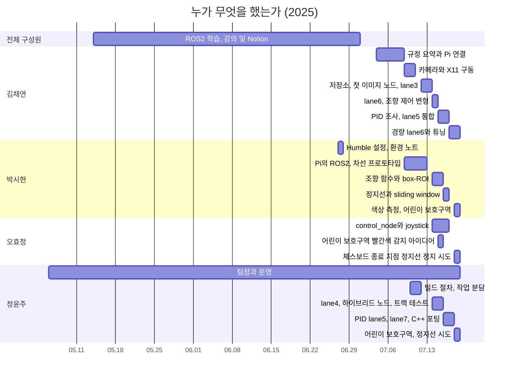

# 팀 기여

[← README](../README_ko.md) · [English](contributions.md) | **한국어**

## 한눈에 보기

| 팀원 | 역할 | 주요 결과물 |
|---|---|---|
| **김채연** @ChaeYeonKim0204 | 환경, 통합, 최종 차선 노드 | 카메라 구동, GitHub 저장소, lane3, lane6, `lane_following_node` |
| **박시현** @kha-2 | 인지 조사와 설계 | 차선 프로토타입, box-ROI 노드, lane5 파이프라인, 색상 측정, 어린이 보호구역 감속, `tools/hsv_picker.py` |
| **오효정** @ohhyojeong | 차량 제어와 운영 | `control_node`, joystick 자동/수동 구조, 어린이 보호구역 아이디어 |
| **정윤주** @yoonju04 | 팀장, 대회 중 주요 알고리즘 개발 | lane4, PID lane5, lane7, lane5c, 어린이 보호구역 감속, `tools/capture_frame.py` |

이 저장소의 모든 commit은 저장소와 빌드 노트북을 관리한 김채연 계정에서 작성됨  
commit 안의 많은 코드는 팀원이 작성해 팀 채팅으로 공유한 코드이며, `Co-authored-by` trailer로 해당 commit 표시

평소 작업 방식: 팀원별 코드 작성·채팅 공유 → 김채연이 실차에서 실행 → 오류 메시지 기반으로 문법 오류·오타·import 누락 수정 → 알고리즘 문제는 작성자에게 전달해 수정 요청  
새 접근 아이디어도 대부분 김채연이 제시, 팀원 기억 기반

## 누가 언제 무엇을 했는가

| 날짜 | 팀원 | 작업 | 결과 |
|---|---|---|---|
| 05.06–07 | 정윤주 | 팀 구성, 지원 동기 작성, 신청서 제출, 팀명 후보 정리 | 팀 등록 |
| 05.07 | 김채연 | 투표로 정한 "Autonome"을 신청서에 기입, 팀원별 신청서 제출 필요 확인 | 팀명 확정 |
| 05.14–06.30 | 전체 구성원 | 함께 ROS2 학습: 강의, Notion 노트, 사전 교육 (06.19), 스터디 회의 (06.30) | 하드웨어 도착 전 기본 내용 공유 |
| 05.21 | 박시현 | ROS2 Humble 최초 설치 | Humble 사용 합의 |
| 06.27 | 박시현 | ROS2 환경 메모 (`.bashrc` aliases, `ROS_DOMAIN_ID`) | 설정 공유 |
| 07.04 | 김채연 | 장비 배부 세션 녹취와 요약 공유 | 팀 규정 참고 자료 |
| 07.08 | 박시현 | 5개 항목 구현 계획 | 최종 시스템과 같은 분담 |
| 07.08 | 김채연 | 첫 Raspberry Pi 연결, 공식 설정 문서, 대회 SD 카드의 IP 변경 사항 공유 | Pi 접속 가능 |
| 07.09 | 박시현 | Pi에 ROS2 설치 | - |
| 07.10 | 김채연 | 카메라 디버깅: 드라이버, pydantic, X11 포워딩 (VcXsrv + `DISPLAY`) | 첫 실시간 카메라 이미지 + 팀 가이드 |
| 07.10–11 | 정윤주 | 워크스페이스와 colcon 빌드 절차, 발행자/구독자 연습, 작업 분담 | 이미지 확인 / 발행자 / 모드 전환 |
| 07.11 | 오효정 | Pi SSH 접속 | 원격 접속 성공 |
| 07.12 | 김채연, 박시현 | 첫 ROS2 이미지 구독자 (김채연의 5개 점검표, 박시현 코드) | 차량에서 Hough 파이프라인 실행 |
| 07.12 | 김채연 | GitHub 저장소, 팀 초대, Git 워크플로 가이드, lane3 | 공유 코드베이스 |
| 07.13 | 김채연, 오효정 | 테스트 트랙 재료 | 학교 테스트 트랙 |
| 07.14 | 김채연 | 고정 조향 테이블 기반 lane6, 이후 Pure Pursuit·PD·헤딩 제어 변형 | lane6로 차량 첫 움직임, 짧은 주행 |
| 07.14 | 정윤주 | lane6 진입점 수정, lane4 트랙 테스트 | 진동 있지만 차선 주행 |
| 07.14 | 박시현 | 조향각 함수 (`180 - angle` mirror, 한쪽 차선 fallback), 테스트 영상, 2차 중심선 아이디어 | - |
| 07.14–15 | 오효정 | joystick 자동/수동 제어 | 모드 전환 동작 |
| 07.15 | 박시현 | box-ROI 차선 노드, 정지선 확인 포함 | 차량에서 정지 ("right lane not detected") |
| 07.15 | 정윤주 | 하이브리드 곡선 / 중심점 노드, "#찐최" 차선 노드 | 차량 미사용 |
| 07.15 | 오효정 | 어린이 보호구역용 빨간색 HSV 감지 | 최종 노드에 아이디어 사용 |
| 07.15 | 김채연 | PID 조사, DonkeyCar line-follower 코드 공유 | PID lane5 기반 |
| 07.16 | 정윤주 | 박시현 파이프라인에 DonkeyCar PID를 lane5로 포팅, TypeError 수정 | "It drove" commit |
| 07.16 | 김채연 | lane5 통합, 차량 실행, TypeError 보고 | - |
| 07.16 | 박시현 | 정지선 상태 머신, 히스토그램 피크 기반 sliding window | 미통합 |
| 07.17 | 김채연, 정윤주 | BEV 참고 사진 (김채연 촬영, 정윤주 지시), 캡처 스크립트 | BEV 미구현 |
| 07.17 | 김채연 | 새 카메라 테스트 (640×480 최대), PID 목표값 의문 제기, 종료 지점 정지선 정지 누락 공유 | 카메라 교체 |
| 07.17 | 정윤주 | lane7, PID lane5 수정, 단일 대표선 모듈, 2차식 맞춤 버전 | 대회 중 마지막 commit |
| 07.17 | 김채연 | 경량 lane6 (21:57), 한쪽 차선 대체 처리와 구간별 타이밍 버전 (22:22) | **07.18 01:25부터 차량 주행** |
| 07.18 | 박시현 | 트랙 색상 측정, HSV 선택기 | 최종 노드용 빨간색 임계값 |
| 07.18 | 박시현, 정윤주 | 김채연의 차선 노드에 **어린이 보호구역 감속**: 흰색 마스크 확대, 노란색 분기 끔, 붉은색 영역 기능 (박시현·정윤주 공동 주도) | **어린이 보호구역 통과** |
| 07.18 | 김채연 | 최종 레이스 버전 통합 (13:02): 어린이 보호구역 변경이 반영된 경량 차선 노드, 문법 오류·오타 수정 (깨진 빨간색 범위, `teering_angle` 오타 등) | **랩 완주** |
| 07.18 | 박시현, 정윤주 | 정지선·횡단보도 감지: 오전 흰색 픽셀 수·7초 타이머 (김채연 아이디어) → 13:02 세로선 개수로 횡단보도 판정 | 불안정, 수정 시간 부족 → 폐기 |
| 07.18 | 오효정 | 체스보드 감지로 종료 지점 정지선 정지 (13:18 박시현 게시 버전) | 정의되지 않은 변수 → 미사용 |

## 김채연

**준비**
- 투표로 정한 팀명 신청서 기입, 팀원별 신청서 제출 규정 확인 (05.07)
- 교수님에게 받은 ROS 학습 경로 (05.14), 일정 조율과 회의록
- 장비 배부 세션 녹취와 요약 공유 (07.04): 규정, 필수 모드 전환, 현장 색상 튜닝, "keep the algorithm simple for the Pi"
- 첫 Raspberry Pi 연결, 공식 설정 문서, SD 카드 IP 문제 (07.08)

**환경과 저장소**
- Pi 카메라: 드라이버 설치, pydantic 하향 조정, 실제 해결책은 접근 제어 해제 상태의 VcXsrv와 `DISPLAY=<laptop IP>:0` (07.10)
- 첫 이미지 구독자용 5개 점검표: 의존성, 패키지 구조, topic 이름, 오타, launch (07.12)
- 팀원이 Pi 코드를 읽을 수 있도록 private GitHub 저장소 개설, Git 워크플로 가이드 (07.12), 모든 commit과 날짜별 백업 branch
- Pi용 휴대폰 핫스팟 네트워크 (07.11, 07.15)

**조향 제어, 차례로 시도**
- 고정 조향 테이블, 좌/직진/우 값 하드코딩 (07.14)
- 소실점 대상 Pure Pursuit (07.14 15:52)
- 차선 오프셋 PD: 로컬 kp 1.0 / kd 0.4, 공유본 kp 0.4 / kd 0.1 (07.14 17:20–17:58)
- 이미지 y축을 뒤집은 차량 좌표계 헤딩 제어 (07.14 21:33)
- PID 조사와 DonkeyCar line follower (07.15), PID 목표값 검토 (07.17)
- 기울기 기반 규칙 조향과 한쪽 차선 대응 (07.17 22:22)
- 최종 비례 조향: 이득, 데드밴드 (±5° → ±8°), 보정값, 비대칭 한계, throttle을 트랙에서 튜닝 (07.18)

**차선 주행**
- lane3 (07.12), 고정 조향 테이블 기반 lane6 → 차량이 짧게 움직이기 시작 (07.14)
- PID 조사와 PID lane5가 포팅한 DonkeyCar line-follower 코드 (07.15), lane5 통합과 차량 실행 (07.16)
- 새 카메라 테스트, PID 목표값과 종료 지점 정지선 정지 검토 (07.17)
- Instructables "Lane Keeping Car" Raspberry Pi 알고리즘 발견 후 `짜집기.py`로 노드에 병합 (07.17 21:57), `compute_pd_control` 포함, 한쪽 차선 대체 처리와 구간별 타이밍 버전 (22:22)
- 평균 계산 반복문 크래시 수정과 -0.23 보정값 추가 (07.18 01:25), 최종 레이스 버전 통합 (13:02), 박시현·정윤주의 어린이 보호구역 변경이 반영된 경량 노드

**통합·아이디어·팀**
- **차량 제어**: 무응답 `control_node` 진단(07.15), auto-mode subscriptions 복원된 07.16 버전 게시, 초기 조향 -0.23 및 timer 변경(07.16 16:58), lane nodes와 통합
- 기울기 방식 초안 이후 흰색 픽셀 수로 정지선·횡단보도를 판별하자고 제안 (07.18)
- **통합·디버깅**: 팀원 코드를 실차에서 실행, 오류 메시지 기반으로 문법 오류·오타·import 누락 수정, 알고리즘 문제는 작성자에게 피드백 (예: 07.16 lane5 들여쓰기·디버그 창, 07.18 빨간색 범위·`teering_angle` 오타)
- joystick 주행을 ground truth로 기록하자고 제안 (07.12), team boxbox와 공동 연습 트랙 준비 (07.16)

## 박시현

**준비**
- 오효정을 팀에 합류시킴 (05.06)
- ROS2 Humble 최초 설치와 ROS 강의 playlist 공유 (05.21)
- ROS2 환경 메모: `.bashrc` aliases, `ROS_DOMAIN_ID`, build 후 source (06.27), 스터디 회의에서 Notion ROS2 학습 페이지 공유 (06.30)
- 구현 계획: 모드 전환, usb_cam, image publish/subscribe 기반 차선 노드, PiRacer 제어, Pi 문제 (07.08)
- Raspberry Pi에 ROS2 설치, OpenCV 차선 감지 tutorial 공유 (07.09)

**차선 감지**
- Notion의 차선 감지 코드: 밝기 / HSV mask, ROI, Hough, 좌우 regression (07.10), lane1–3 기반
- 김채연과 첫 ROS2 이미지 구독자 작성 (07.12), 학교 테스트 트랙 차량 주행 촬영 (07.13)
- 조향각 함수 3차 수정: slope → angle, `180 - angle` mirror, 한쪽 차선 fallback (07.14 13:57–15:35), 테스트 주행 영상 5개 (07.14)
- BEV용 2차 중심선 아이디어 (07.14 21:26)
- box-ROI 차선 노드: 6 + 5 차선 박스, 흰색 픽셀 중심점, 정지선 박스 2개 (07.15 09:57–10:09), "right lane not detected" 주행 후 더 큰 박스 계획
- 대표점 6개 기반 2차 `fit_line` / `regression` 함수 (07.15 14:03)
- "#찐최" 노드를 2차 중심선으로 수정 (07.15 22:44), 07.16 PID lane5의 기반 파이프라인
- sliding-window 검출기: 히스토그램 피크, window 9개, 2차식 맞춤 (07.16 23:23)
- PID lane5 코드 리뷰 ("slope is not needed")와 평균선 대안 (07.17)

**미션과 측정**
- 정지선 상태 머신: 작은 ROI의 흰색 픽셀, 횡단보도 이후 회전 교차로 정지선을 무시하는 0/1/2 code (07.16, 미통합)
- **트랙 색상 측정** with HSV picker (07.18 09:19–10:59): red H 174–179 → 최종 임계값, 마스크와 크게 벗어난 노란색 샘플
- 김채연의 차선 노드에서 정윤주와 **어린이 보호구역 감속 공동 주도** (07.18): 더 넓은 흰색 마스크, 노란색 분기 비활성화, 측정 임계값 적용 붉은색 영역 함수
- 정윤주와 흰색 픽셀 기반 정지선·횡단보도 감지 구현 (07.18, 폐기), 체스보드 종료 지점 정지선 정지 버전 게시 (13:18)

**팀**
- 팀 구호 "소처럼 일해서 완주로" (07.16)

## 오효정

**준비**
- 팀명 투표와 첫 회의 일정 조율 (05.06–07)
- 공식 참가자 채팅방 공유, 정원 초과 상태에서 김채연이 들어가도록 운영진에게 요청 (06.02)

**환경**
- Raspberry Pi SSH 접속 (07.11)
- 핫스팟 수정용 Pi 실험실 간 이동 (07.15), 대회장 이동 전 학교에서 Pi Wi-Fi 변경 (07.16)
- pygame 기반 joystick 감지 확인 (07.16 22:52)

**차량 제어**
- **`control_node`와 joystick 구조**: 차선 노드 또는 gamepad 명령을 전달하는 PiRacerPro 드라이버, 기본 자동 모드와 버튼 입력 시 수동 전환 (07.14–15)
- 무반응 control node 디버깅 중 joystick 버전 `control_node` 게시 (07.15 16:30–16:55)
- 0.2초 제어 주기를 느린 반응 원인으로 의심 (07.16 01:24)
- 최종 레이스에서 해당 구조 사용, 07.16에 자동 모드 구독 복구

**미션**
- 어린이 보호구역용 빨간색 감지: 빨간색 감지 시 감속과 직진 (07.15 18:07) → 최종 노드에 아이디어 사용
- 체스보드 감지 (`cv2.findChessboardCorners`)로 종료 지점 정지선 정지 시도 (07.18, 최종 주행 미사용)

**운영**
- 테스트 트랙 재료와 측정 물품 (07.13), 대회장 장비 운반 (07.16)

## 정윤주

**팀장**
- 팀 구성, 팀명 후보, 지원 동기, 신청서 (05.06–07)
- 교수님 미팅 (05.14), Discord 온라인 회의 (05.27, 07.11), 팀 티셔츠 (06.27)
- 주간 목표 "차선 감지 코드 작성" 설정 (06.30), 강의실·멀티탭·Pi 대학원생 점검 (07.09–10), 대회장 조립 계획 (07.16)

**시스템 설계와 환경**
- C++ 차선 감지 예제와 PiRacer 모터 테스트 공유 (07.10)
- 워크스페이스와 colcon 빌드 절차, 발행자/구독자 연습 (07.10–11)
- Raspberry Pi 휴대폰 핫스팟, SSH와 X11 (07.11)
- 시스템을 이미지 확인 / 조향-스로틀 발행자 / 모드 전환으로 분리 (07.11)
- colcon 오류용 `package.xml` dependency 수정 제안 (07.12), pull로 사라진 lane6 진입점 수정 재적용 (07.14)

**차선 주행**
- lane4 트랙 테스트: 진동 있지만 차선 주행 (07.14), 김채연 Pure Pursuit 테스트와 보고 (07.14 16:00)
- 박시현 box-ROI 노드를 lane5로 실행하고 로그 게시 (07.15 15:29)
- 하이브리드 노드: 2차식 맞춤, 중심점, 직선 fallback, 약 850줄 (07.15 15:56), "#찐최" 차선 노드 (07.15 22:25)
- "#찐최" 노드 리뷰, 밤샘 PID 계획 (07.16 00:49–01:06)
- 박시현 파이프라인에 DonkeyCar PID를 lane5로 포팅 (07.16 15:43–16:06) → "it drove" (07.16), `predicDir` TypeError 수정 (17:41)
- C++ 포팅 lane5c (07.16 23:20)
- histogram + PID 기반 lane7 (07.17 00:28), 정윤주 본인 아이디어(박시현 확인)
- BEV 조사, calibration 사진 촬영 지시와 캡처 스크립트 (07.17 03:33–04:37)
- 하드코딩 한쪽 차선 조향 포함 PID lane5 버전 A–E (07.17 13:47–15:33), 단일 대표선 모듈 (17:19)
- 2차식 맞춤 PID lane5 (07.17 19:28–20:07), 대회 중 마지막 commit

**미션**
- 카메라 좌우 반전 명령 (07.18 07:59)
- 흰색 픽셀·7초 타이머 기반 정지선·횡단보도 감지 (10:48–10:51), 박시현과 세로선 기반 횡단보도 확인 (13:02, 폐기)
- 최종 노드에서 박시현과 **어린이 보호구역 감속 공동 주도** (07.18): 더 넓은 흰색 마스크, 노란색 분기 비활성화, 붉은색 영역 함수

## 최종 코드 미사용

| 작업 | 팀원 | 미사용 이유 |
|---|---|---|
| lane4, lane5 (PID), lane5c, lane7 | 정윤주, 박시현 | Pi에 너무 무겁거나 시간 내 준비 미완료 (`experiments/`에 보관) |
| 정지선 상태 머신, sliding window | 박시현 | 미통합 |
| 흰색 픽셀 수·7초 타이머 기반 정지선·횡단보도 | 박시현, 정윤주 (아이디어: 김채연) | 불안정과 오류, 2차 레이스 전 수정 시간 부족 |
| 체스보드 종료 지점 정지선 정지 | 오효정 (박시현 게시 버전) | 13:18 버전의 정의되지 않은 변수 |
| 노란색 차선 분기 | 김채연 | 노란색 감지 시 크래시, 트랙의 노란색이 마스크와 불일치 |
| BEV (bird's-eye view) | 정윤주, 김채연 | 조사와 촬영 진행, 구현 없음 |

## 출처와 주의

- 근거: git 이력, 팀 KakaoTalk 채팅 (05.06–07.18), Notion 내보내기, 로컬 작업 파일, 공식 가이드라인과 배포 자료 PDF, 언론 보도의 팀·대학 수
- 채팅에 코드를 붙여넣은 사람이 항상 작성자는 아님, 기여 표기는 채팅 맥락 기준이며 가능한 경우 김채연 확인
- 팀의 기억에 따른 내용(채팅에 보이지 않음): white-pixel stop-line 아이디어 및 구현자, 어린이 보호구역 담당자, chessboard 담당자
- 박시현 확인(2026-10-07): lane7 histogram 아이디어는 sliding-window detector와 별개인 정윤주 아이디어
- 레이스 결과 (완주, 어린이 보호구역 통과, 차로 이탈 약 2회, 24팀 중 12위, 4:52.5)는 팀 기억 기반, 채팅 기록에는 없음