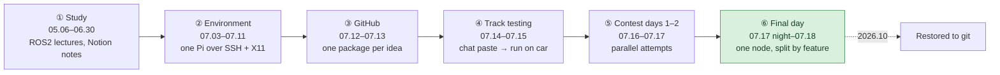
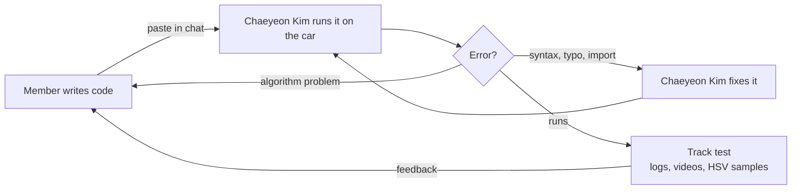

# Repository Guide

[← README](../README.md) · **English** | [한국어](repository_ko.md)

## Folder Tree

```text
seame-2025/                        (ROS2 workspace src/)
├── README.md / README_ko.md       Project overview (English / Korean)
├── docs/                          Detailed docs: contributions, post-mortem, timeline, this guide
│
├── lane_following/                [team] Final race lane node (originally lane6_pkg)
│   ├── lane_following/
│   │   └── lane_following_node.py     HSV mask → ROI → Canny → Hough → averaged lines → heading → steering
│   │                                  + red-zone slowdown
│   └── launch/lane_following_launch.py   camera + lane node + control_node
│
├── control/                       [team] Vehicle control (based on the organizer's PiRacer demo)
│   ├── control/
│   │   ├── control_node.py            PiRacerPro driver: auto (/steering, /throttle) or manual commands
│   │   ├── mode_switch_node.py        gamepad button 0 toggles /mode
│   │   └── manual_control_node.py     gamepad → /manual_steering, /manual_throttle
│   └── launch/control_launch.py
│
├── camera/                        [third-party] usb_camera_driver (DGIST ARTIV fork of klintan/ros2_usb_camera)
│
├── experiments/                   [team] Tried during the contest, not used in the final run
│   ├── lane4_pkg/                     vanishing point + steering table
│   ├── lane5_pkg/                     quadratic lane fit + DonkeyCar-style PID
│   ├── lane5c_pkg/                    C++ (rclcpp) port of lane5 (does not build as written)
│   └── lane7_pkg/                     histogram two-peak lane centre + PID
│
└── tools/                         [team] Used on the track
    ├── capture_frame.py               live preview and frame capture (camera images for BEV work)
    └── hsv_picker.py                  click a pixel to print its HSV value (track colour measurement)
```

`[team]` written by our team · `[third-party]` open-source package included as obtained (source below)

## Workflow

### How the Workflow Changed



### Phase by Phase

| Phase | Code sharing | Testing | Version control | Division of work | Integration |
|---|---|---|---|---|---|
| ① Study | Notion notes | — | — | Study by layer | — |
| ② Environment | Notion code | Still images on Windows | — | 5-item plan, 3-node split | Chaeyeon Kim's laptop |
| ③ GitHub | GitHub + chat | First runs on the Pi | `lane1`–`lane5` packages, `main` | Each member a different node version | Chaeyeon Kim's account |
| ④ Track testing | Chat pastes | School test track | Dated backup branches | Versions per member, logs and videos | Chaeyeon Kim runs and debugs |
| ⑤ Contest days 1–2 | Chat pastes | Venue track (shared with team boxbox) | Backup branches until 07.17 23:10 | PID, C++ port, sliding window, stop line in parallel | Chaeyeon Kim runs and debugs |
| ⑥ Final day | Chat pastes only | Venue track, on-site HSV measurement | None (paste time = version) | Steering, child zone, stop line, chessboard on one node | Chaeyeon Kim merges the 13:02 race version |

### The Test Loop (phases ④–⑥)



- **Worked**: one person could run any member's code within minutes
- **Cost**: most code moved as chat pastes, a pinned copy was cut off, a local fix was lost to a pull, `main` stopped on 07.13, and the final race version existed only in the chat until it was restored here

## Branches & Tags

| Ref | What it contains |
|---|---|
| `main` | Cleaned-up project: contest history + the race-day lane versions + folder restructure + post-contest fixes + docs |
| tag `contest-2025-07-18` | Exact code of the final run (race 2, 07.18 13:02) |
| tag `archive/original-history` | Original history with the original (Korean) commit messages, tip of the last backup branch (07.17 23:10) |
| tag `archive/original-main` | Original `main` (07.13) |
| tag `archive/original-250713` | Original side branch (`backup-250713`) |
| `history/lane6-idea-2025-07-13` | Side branch with a lane6 variant uploaded through the GitHub web UI (07.13–14); its ideas were re-applied by hand on `main` |

The commits on `main` up to 07.17 23:10 keep their original dates and content; only the messages were rewritten in English (each keeps `Original message:`). The five lane6 commits from 07.17 21:57 to 07.18 13:02 were added after the contest from the team chat and a local working file, with their original times.

## Third-party Code

| Path | Source | Notes |
|---|---|---|
| `camera/` | Fork by DGIST ARTIV Lab of [klintan/ros2_usb_camera](https://github.com/klintan/ros2_usb_camera) | Closest upstream commit [`b76e697`](https://github.com/klintan/ros2_usb_camera/commit/b76e6978587cebc79d077a65d2adcf47df14f51f) (2020-05-16); the fork changes the build, launch files and driver source; the fork's own repository could not be located · Apache-2.0 · unchanged by our team |
| `control/control/control_node.py` (first version) | Organizer-provided PiRacer demo | Extended by the team for auto/manual switching |
| `lane_following/…/lane_following_node.py` (core) | [Instructables "Autonomous Lane-Keeping Car Using Raspberry Pi and OpenCV"](https://www.instructables.com/Autonomous-Lane-Keeping-Car-Using-Raspberry-Pi-and/) Raspberry Pi project (`LaneKeepingAlgorithm.py`) | Line averaging, heading angle and the PD block adapted into our ROS2 node |
