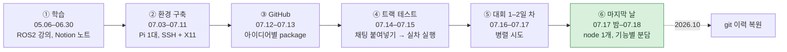
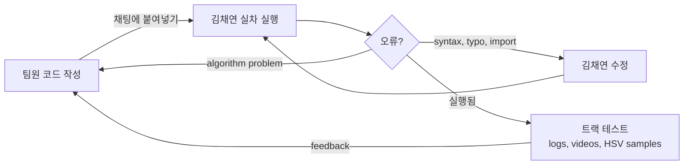

# 저장소 가이드

[← README](../README_ko.md) · [English](repository.md) | **한국어**

## 폴더 구조

```text
seame-2025/                        (ROS2 workspace src/)
├── README.md / README_ko.md       프로젝트 개요 (영어 / 한국어)
├── docs/                          상세 문서: 기여, 사후 분석, 타임라인, 이 가이드
│
├── lane_following/                [team] 최종 레이스 차선 node (원래 lane6_pkg)
│   ├── lane_following/
│   │   └── lane_following_node.py     HSV mask → ROI → Canny → Hough → 평균선 → heading → steering
│   │                                  + 붉은색 영역 slowdown
│   └── launch/lane_following_launch.py   camera + lane node + control_node
│
├── control/                       [team] 차량 제어 (주최 측 PiRacer demo 기반)
│   ├── control/
│   │   ├── control_node.py            PiRacerPro driver: auto (/steering, /throttle) 또는 manual commands
│   │   ├── mode_switch_node.py        gamepad button 0으로 /mode 토글
│   │   └── manual_control_node.py     gamepad → /manual_steering, /manual_throttle
│   └── launch/control_launch.py
│
├── camera/                        [third-party] usb_camera_driver (DGIST ARTIV fork of klintan/ros2_usb_camera)
│
├── experiments/                   [team] 대회 중 시도, 최종 주행 미사용
│   ├── lane4_pkg/                     vanishing point + steering table
│   ├── lane5_pkg/                     quadratic lane fit + DonkeyCar-style PID
│   ├── lane5c_pkg/                    lane5의 C++ (rclcpp) port (현재 상태로 build 불가)
│   └── lane7_pkg/                     histogram two-peak lane centre + PID
│
└── tools/                         [team] 트랙에서 사용
    ├── capture_frame.py               live preview와 frame capture (BEV 작업용 camera images)
    └── hsv_picker.py                  pixel 클릭 시 HSV 값 출력 (track colour measurement)
```

`[team]` 우리 팀 작성 · `[third-party]` 확보한 그대로 포함한 open-source package (출처는 아래)

## Workflow

### Workflow 변화



### 단계별 비교

| 단계 | 코드 공유 | 테스트 | 버전 관리 | 분업 | 통합 |
|---|---|---|---|---|---|
| ① 학습 | Notion 노트 | 없음 | 없음 | 계층별 학습 | 없음 |
| ② 환경 구축 | Notion 코드 | Windows 정지 이미지 | 없음 | 할 일 5개, node 3개 분리 | 김채연 노트북 |
| ③ GitHub | GitHub + 채팅 | Pi 첫 실행 | `lane1`–`lane5` packages, `main` | 팀원별 다른 node 버전 | 김채연 계정 |
| ④ 트랙 테스트 | 채팅 붙여넣기 | 학교 테스트 트랙 | 날짜별 backup branches | 팀원별 버전, logs와 videos | 김채연 실행·debug |
| ⑤ 대회 1–2일 차 | 채팅 붙여넣기 | 대회장 트랙 (team boxbox와 공유) | 07.17 23:10까지 backup branches | PID, C++ port, sliding window, stop line 병렬 | 김채연 실행·debug |
| ⑥ 마지막 날 | 채팅 붙여넣기만 | 대회장 트랙, 현장 HSV 측정 | 없음 (붙여넣은 시각 = version) | node 1개에 steering, 어린이 보호구역, stop line, chessboard 분담 | 김채연이 13:02 race version 통합 |

### 테스트 루프 (④–⑥단계)



- **장점**: 한 사람이 어느 팀원 코드든 몇 분 안에 실차 실행
- **대가**: 대부분 채팅 붙여넣기로 코드 이동, 고정 공지 코드 잘림, pull로 local fix 유실, `main`은 07.13에서 중단, 최종 race version은 복원 전까지 채팅에만 존재

## Branches & Tags

| Ref | 내용 |
|---|---|
| `main` | 정리된 프로젝트: 대회 기록 + race-day lane versions + 폴더 구조 변경 + 대회 후 수정 + docs |
| tag `contest-2025-07-18` | 최종 주행의 정확한 코드 (race 2, 07.18 13:02) |
| tag `archive/original-history` | 원래 한국어 commit messages를 포함한 원본 이력, 마지막 backup branch 끝 지점 (07.17 23:10) |
| tag `archive/original-main` | 원본 `main` (07.13) |
| tag `archive/original-250713` | 원본 side branch (`backup-250713`) |
| `history/lane6-idea-2025-07-13` | GitHub web UI로 업로드한 lane6 variant side branch (07.13–14), 해당 아이디어는 `main`에 수동 재적용 |

`main`의 07.17 23:10까지 commits는 원래 날짜와 내용 유지, messages만 영어로 재작성 (각 commit에 `Original message:` 유지)  
07.17 21:57부터 07.18 13:02까지 lane6 commits 5개는 대회 후 팀 채팅과 local working file에서 추가, 원래 시각 유지

## Third-party Code

| Path | Source | Notes |
|---|---|---|
| `camera/` | [klintan/ros2_usb_camera](https://github.com/klintan/ros2_usb_camera)의 DGIST ARTIV Lab fork | 가장 가까운 upstream commit [`b76e697`](https://github.com/klintan/ros2_usb_camera/commit/b76e6978587cebc79d077a65d2adcf47df14f51f) (2020-05-16), fork에서 build, launch files, driver source 변경, fork 자체 저장소는 찾지 못함 · Apache-2.0 · 우리 팀 변경 없음 |
| `control/control/control_node.py` (first version) | 주최 측 제공 PiRacer demo | 팀에서 auto/manual switching용으로 확장 |
| `lane_following/…/lane_following_node.py` (core) | [Instructables "Autonomous Lane-Keeping Car Using Raspberry Pi and OpenCV"](https://www.instructables.com/Autonomous-Lane-Keeping-Car-Using-Raspberry-Pi-and/) Raspberry Pi project (`LaneKeepingAlgorithm.py`) | line averaging, heading angle, PD block을 우리 ROS2 node에 맞게 적용 |