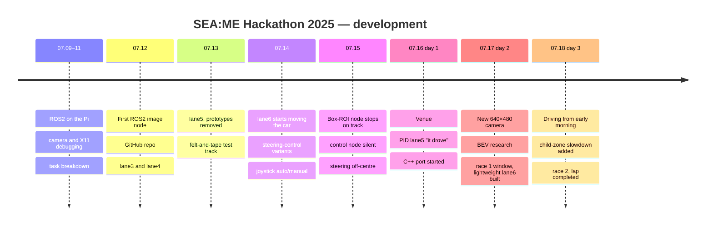

# Timeline

[← README](../README.md) · **English** | [한국어](timeline_ko.md)

## Before the Contest (2025)

| Date | Event |
|---|---|
| 05.06–07 | Team formed (4 members), application and motivation letter submitted; name "Autonome" chosen by poll |
| 05.14–06.30 | ROS2 study by all members: lectures, Notion notes, meetings |
| 05.21 | ROS2 Humble agreed tentatively (a senior advised one shared version; the organizers later confirmed Humble) |
| 05.30 | Selection email for the hackathon |
| 06.05 | Orientation: PiRacer + ROS2 confirmed |
| 06.19 | Pre-training: ROS2 publisher / subscriber exercise with the organizer's reference code, `rqt_graph` |
| 06.30 | First in-person study meeting; week goal set: write lane-detection code (07.07–12) |
| 07.03 | Equipment handout and rules: deep learning, special cameras and motor changes not allowed, time penalties for failed missions, USB camera, mandatory mode switch, colour values tuned on site, "simple and fast for the Pi" |
| 07.08 | First Raspberry Pi connection; five-item implementation plan; official setup documents shared |

## Development Timeline (2025)

| Date | Event | Commit |
|---|---|---|
| 07.10 | Live camera image on the laptop after the X11 fix (camera failed to open again on 07.11) | — |
| 07.12 | Repository created; first image subscriber; camera driver, control node, lane prototypes; lane3, lane4 | `Add camera driver…`, `Add lane3…`, `Add lane4…` |
| 07.13 | Test track built; ~17:00 car run filmed; lane5 and lane6 added, early prototypes removed | `Remove early prototypes…` |
| 07.14 | lane6 starts moving the car with a fixed steering table (short runs); curves | `lane6: car starts moving…`, `lane6: handle curves…` |
| 07.14 | Joystick auto/manual mode (auto-mode subscriptions accidentally dropped) | `Add joystick auto/manual mode switching…` |
| 07.15 | Box-ROI node logs "right lane not detected → stop" ~190 times; control node, buttons and manual mode silent | — |
| 07.16 | Venue; control subscriptions restored; PID lane5 drives | `Restore auto-mode subscriptions…`, `lane5: drives with DonkeyCar-style PID…` |
| 07.17 03:38 | lane7 and lane5c added | `Add lane7…` |
| 07.17 21:57 | lane6 rebuilt on the lightweight pipeline (local file) | `lane6: rebuild on a lightweight…` |
| 07.17 23:10 | Quadratic-fit PID lane5 (last commit made during the contest) | `lane5: quadratic lane fit…` |
| 07.17 23:20 | lane6 on the new camera topic; first run crashes (not a race attempt) | `lane6: subscribe to the new camera's…` |
| 07.18 01:25 | Averaging loop fixed, -0.23 trim added; car drives continuously from here | `lane6: fix the lane-averaging loop…` |
| 07.18 08:21 | Yellow branch fixes | `lane6: fix yellow-branch NameError…` |
| 07.18 13:02 | Final race version: child-zone slowdown (Sihyeon Park, Yoonju Jeong) on Chaeyeon Kim's lane node | `lane6: final race tuning…` · tag `contest-2025-07-18` |

## Contest Days (07.16–18)

**Day 1 (07.16)**
- 00:49 review of the "#찐최" lane node (NoneType crash with one lane, steering stuck at -0.22); 01:06 PID planned overnight; morning: Pi Wi-Fi and camera checks planned
- 11:37 arrival at the venue; auto/manual mode check
- 15:43 PID added to lane5 (DonkeyCar line follower), small fixes until 16:06; 17:12 shared practice track agreed with team boxbox
- 17:33 Chaeyeon Kim integrates lane5 and runs it on the car → 17:36 `TypeError` → fixed at 17:41
- 18:50–19:07 lane split fixed (x_center at half width), PID retuned → "it drove"
- Night: C++ port and sliding-window detector started

**Day 2 (07.17)**
- 00:28 lane7 (histogram) does not detect lanes; 03:33–04:37 BEV research and bird's-eye-view reference photos
- 13:15 new USB camera tested (640×480 max); topic moves to `/camera/image_raw`; finish-stop logic found missing
- 13:47–15:33 straight-line-fit PID lane5 revisions (one-lane fallback tried); 17:19 single representative-line module; 19:28 quadratic-fit version
- 19:00–24:00 **race 1 window**; 19:33 the Instructables lane-keeping project found
- 21:57 lightweight lane6 assembled; 22:22 one-lane fallback and timing versions; 23:20 first run → `UnboundLocalError`

**Day 3 (07.18)**
- 01:25 averaging loop fixed → **the car drives continuously**
- 01:25–01:26 yellow and white-only versions; 07:59 camera flip command proposed; 08:21 yellow branch fixes
- 09:19–11:06 track colour measurements (red H 174–179, yellow washed out)
- 10:48–13:18 stop line and crosswalk: white-pixel count (morning) → vertical-line count for the crosswalk (13:02); chessboard finish stop; unreliable, no time to fix → left out of the final run
- 13:02 final race version: Chaeyeon Kim's lane node + child-zone slowdown by Sihyeon Park and Yoonju Jeong
- ~13:00 **race 2**: lap completed, child zone passed, about 2 lane departures
- Result (team recollection; awards at 16:00 per the official schedule): **12th of 24, 4:52.5 including penalties**
