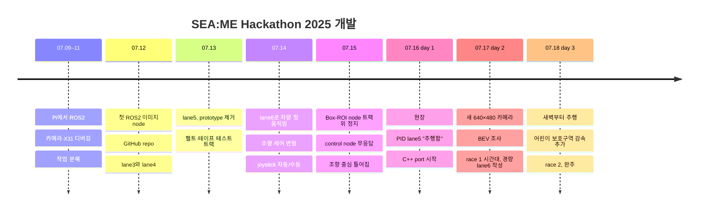

# 타임라인

[← README](../README_ko.md) · [English](timeline.md) | **한국어**

## 대회 전 (2025)

| 날짜 | 이벤트 |
|---|---|
| 05.06–07 | 팀 결성 (4명), 지원서·동기서 제출, 투표로 팀명 "Autonome" 결정 |
| 05.14–06.30 | 전체 구성원의 ROS2 학습: 강의, Notion 노트, 회의 |
| 05.21 | ROS2 Humble 잠정 합의 (선배가 공통 버전 1개 권고, 이후 주최 측 Humble 확정) |
| 05.30 | 해커톤 선정 메일 |
| 06.05 | 오리엔테이션: PiRacer + ROS2 확정 |
| 06.19 | 사전 교육: 주최 측 예제 코드로 ROS2 publisher / subscriber 실습, `rqt_graph` |
| 06.30 | 첫 오프라인 스터디, 주간 목표 설정: 차선 인식 코드 작성 (07.07–12) |
| 07.03 | 장비 배부·규정: 딥러닝·특수 카메라·모터 변경 불가, 미션 실패 시 시간 패널티, USB 카메라, 모드 전환 필수, 현장 색상값 튜닝, "Pi에 맞게 단순하고 빠르게" |
| 07.08 | 첫 Raspberry Pi 연결, 구현 계획 5개 항목, 공식 세팅 문서 공유 |

## 개발 타임라인 (2025)

| 날짜 | 이벤트 | commit |
|---|---|---|
| 07.10 | X11 수정 후 노트북에서 실시간 카메라 이미지 확인 (07.11 카메라 다시 열기 실패) | 없음 |
| 07.12 | 저장소 생성, 첫 이미지 subscriber, camera driver, control node, 차선 prototype, lane3, lane4 | `Add camera driver…`, `Add lane3…`, `Add lane4…` |
| 07.13 | 테스트 트랙 제작, ~17:00 차량 주행 촬영, lane5·lane6 추가, 초기 prototype 제거 | `Remove early prototypes…` |
| 07.14 | lane6 고정 조향 테이블로 차량이 짧게 움직임, 곡선 처리 | `lane6: car starts moving…`, `lane6: handle curves…` |
| 07.14 | joystick 자동/수동 모드 (auto-mode subscriptions 실수로 누락) | `Add joystick auto/manual mode switching…` |
| 07.15 | Box-ROI node가 "right lane not detected → stop" 약 190회 로그, control node·버튼·수동 모드 무응답 | 없음 |
| 07.16 | 현장, control subscriptions 복구, PID lane5 주행 | `Restore auto-mode subscriptions…`, `lane5: drives with DonkeyCar-style PID…` |
| 07.17 03:38 | lane7·lane5c 추가 | `Add lane7…` |
| 07.17 21:57 | 경량 pipeline 기반 lane6 재구성 (로컬 파일) | `lane6: rebuild on a lightweight…` |
| 07.17 23:10 | 2차식 fit PID lane5 (대회 중 마지막 commit) | `lane5: quadratic lane fit…` |
| 07.17 23:20 | 새 camera topic 기반 lane6, 첫 실행 crash (race 시도 아님) | `lane6: subscribe to the new camera's…` |
| 07.18 01:25 | 평균 loop 수정, -0.23 보정값 추가, 이후 차량 연속 주행 | `lane6: fix the lane-averaging loop…` |
| 07.18 08:21 | 노란색 branch 수정 | `lane6: fix yellow-branch NameError…` |
| 07.18 13:02 | 최종 race 버전: 김채연 lane node에 박시현·정윤주의 어린이 보호구역 감속 추가 | `lane6: final race tuning…` · tag `contest-2025-07-18` |

## 대회 기간 (07.16–18)

**Day 1 (07.16)**
- 00:49 "#찐최" lane node 리뷰 (차선 1개일 때 NoneType crash, 조향 -0.22 고정), 01:06 밤샘 PID 계획, 오전: Pi Wi-Fi·카메라 확인 예정
- 11:37 현장 도착, 자동/수동 모드 확인
- 15:43 lane5에 PID 추가 (DonkeyCar line follower), 16:06까지 소규모 수정, 17:12 boxbox 팀과 공용 연습 트랙 합의
- 17:33 김채연이 lane5 통합 후 차량에서 실행 → 17:36 `TypeError` → 17:41 수정
- 18:50–19:07 차선 분리 수정 (x_center를 절반 너비로), PID 재튜닝 → "주행함"
- 밤: C++ port·sliding-window detector 시작

**Day 2 (07.17)**
- 00:28 lane7 (histogram) 차선 미검출, 03:33–04:37 BEV 조사·bird's-eye-view 참고 사진
- 13:15 새 USB 카메라 테스트 (최대 640×480), topic `/camera/image_raw`로 이동, 종료 지점 정지선 정지 logic 누락 확인
- 13:47–15:33 직선 fit PID lane5 수정 (차선 1개 fallback 시도), 17:19 단일 대표선 module, 19:28 2차식 fit 버전
- 19:00–24:00 **race 1 시간대**, 19:33 Instructables lane-keeping project 발견
- 21:57 경량 lane6 조립, 22:22 차선 1개 fallback·timing 버전, 23:20 첫 실행 → `UnboundLocalError`

**Day 3 (07.18)**
- 01:25 평균 loop 수정 → **차량 연속 주행**
- 01:25–01:26 노란색·흰색 전용 버전, 07:59 카메라 뒤집기 명령 제안, 08:21 노란색 branch 수정
- 09:19–11:06 트랙 색상 측정 (빨강 H 174–179, 노랑 색 빠짐)
- 10:48–13:18 정지선·횡단보도: 흰색 pixel 수 (오전) → 횡단보도 세로선 개수 판정 (13:02), 체스보드 종료 지점 정지선 정지, 불안정과 시간 부족으로 최종 주행에서 제외
- 13:02 최종 race 버전: 김채연 lane node + 박시현·정윤주의 어린이 보호구역 감속
- ~13:00 **race 2**: 완주, 어린이 보호구역 통과, 차로 이탈 약 2회
- 결과 (팀 회고, 공식 일정상 시상식 16:00): **24팀 중 12위, 패널티 포함 4:52.5**